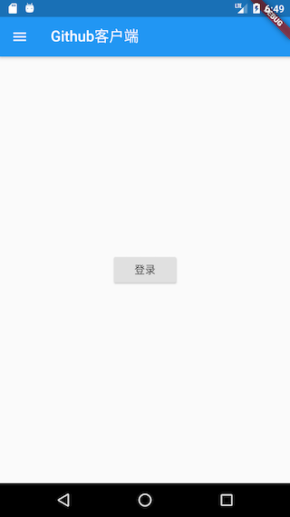
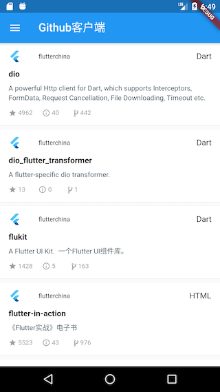
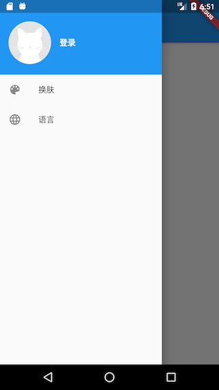
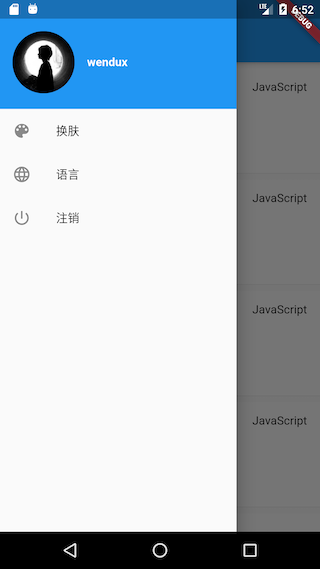

# 15.6 APP入口及主页

本节来介绍一下APP入口及首页。

## 15.6.1 APP入口

`main`函数为APP入口函数，实现如下：

```dart
void main() => Global.init().then((e) => runApp(MyApp()));
```

初始化完成后才会加载UI(`MyApp`)，`MyApp` 是应用的入口Widget，实现如下：

```dart
class MyApp extends StatelessWidget {
  // This widget is the root of your application.
  @override
  Widget build(BuildContext context) {
    return MultiProvider(
      providers: <SingleChildCloneableWidget>[
        ChangeNotifierProvider.value(value: ThemeModel()),
        ChangeNotifierProvider.value(value: UserModel()),
        ChangeNotifierProvider.value(value: LocaleModel()),
      ],
      child: Consumer2<ThemeModel, LocaleModel>(
        builder: (BuildContext context, themeModel, localeModel, Widget child) {
          return MaterialApp(
            theme: ThemeData(
              primarySwatch: themeModel.theme,
            ),
            onGenerateTitle: (context){
              return GmLocalizations.of(context).title;
            },
            home: HomeRoute(), //应用主页
            locale: localeModel.getLocale(),
            //我们只支持美国英语和中文简体
            supportedLocales: [
              const Locale('en', 'US'), // 美国英语
              const Locale('zh', 'CN'), // 中文简体
              //其它Locales
            ],
            localizationsDelegates: [
              // 本地化的代理类
              GlobalMaterialLocalizations.delegate,
              GlobalWidgetsLocalizations.delegate,
              GmLocalizationsDelegate()
            ],
            localeResolutionCallback:
                (Locale _locale, Iterable<Locale> supportedLocales) {
              if (localeModel.getLocale() != null) {
                //如果已经选定语言，则不跟随系统
                return localeModel.getLocale();
              } else {
         
                Locale locale;
                //APP语言跟随系统语言，如果系统语言不是中文简体或美国英语，
                //则默认使用美国英语
                if (supportedLocales.contains(_locale)) {
                  locale= _locale;
                } else {
                  locale= Locale('en', 'US');
                }
                return locale;
              }
            },
            // 注册命名路由表
            routes: <String, WidgetBuilder>{
              "login": (context) => LoginRoute(),
              "themes": (context) => ThemeChangeRoute(),
              "language": (context) => LanguageRoute(),
            },
          );
        },
      ),
    );
  }
}
```

在上面的代码中：

1. 我们的根widget是`MultiProvider`，它将主题、用户、语言三种状态绑定到了应用的根上，如此一来，任何路由中都可以通过`Provider.of()`来获取这些状态，也就是说这三种状态是全局共享的！
2. `HomeRoute`是应用的主页。
3. 在构建`MaterialApp`时，我们配置了APP支持的语言列表，以及监听了系统语言改变事件；另外`MaterialApp`消费（依赖）了`ThemeModel`和`LocaleModel`，所以当APP主题或语言改变时`MaterialApp`会重新构建
4. 我们注册了命名路由表，以便在APP中可以直接通过路由名跳转。
5. 为了支持多语言（本APP中我们支持美国英语和中文简体两种语言）我们实现了一个`GmLocalizationsDelegate`，子Widget中都可以通过`GmLocalizations`来动态获取APP当前语言对应的文案。关于`GmLocalizationsDelegate`和`GmLocalizations`的实现方式读者可以参考”国际化“一章中的介绍，此处不再赘述。

## 15.6.2 主页

为了简单起见，当APP启动后，如果之前已登录了APP，则显示该用户项目列表；如果之前未登录，则显示一个登录按钮，点击后跳转到登录页。另外，我们实现一个抽屉菜单，里面包含当前用户头像及APP的菜单。下面我们先看看要实现的效果，如图15-1、15-2所示：



我们在”lib/routes“下创建一个”home_page.dart“文件，实现如下：

```dart
class HomeRoute extends StatefulWidget {
  @override
  _HomeRouteState createState() => _HomeRouteState();
}

class _HomeRouteState extends State<HomeRoute> {
  @override
  Widget build(BuildContext context) {
    return Scaffold(
      appBar: AppBar(
        title: Text(GmLocalizations.of(context).home),
      ),
      body: _buildBody(), // 构建主页面
      drawer: MyDrawer(), //抽屉菜单
    );
  }
  ...// 省略
}
```

上面代码中，主页的标题（title）我们是通过`GmLocalizations.of(context).home`来获得，`GmLocalizations`是我们提供的一个`Localizations`类，用于支持多语言，因此当APP语言改变时，凡是使用`GmLocalizations`动态获取的文案都会是相应语言的文案，这在前面”国际化“一章中已经介绍过，读者可以前翻查阅。

我们通过 `_buildBody()`方法来构建主页内容，`_buildBody()`方法实现代码如下：

```dart
  Widget _buildBody() {
    UserModel userModel = Provider.of<UserModel>(context);
    if (!userModel.isLogin) {
      //用户未登录，显示登录按钮
      return Center(
        child: RaisedButton(
          child: Text(GmLocalizations.of(context).login),
          onPressed: () => Navigator.of(context).pushNamed("login"),
        ),
      );
    } else {
      //已登录，则展示项目列表
      return InfiniteListView<Repo>(
        onRetrieveData: (int page, List<Repo> items, bool refresh) async {
          var data = await Git(context).getRepos(
            refresh: refresh,
            queryParameters: {
              'page': page,
              'page_size': 20,
            },
          );
          //把请求到的新数据添加到items中
          items.addAll(data); 
          // 如果接口返回的数量等于'page_size'，则认为还有数据，反之则认为最后一页
          return data.length==20;
        },
        itemBuilder: (List list, int index, BuildContext ctx) {
          // 项目信息列表项
          return RepoItem(list[index]);
        },
      );
    }
  }
}
```

上面代码注释很清楚：如果用户未登录，显示登录按钮；如果用户已登录，则展示项目列表。这里项目列表使用了`InfiniteListView` Widget，它是flukit package中提供的。`InfiniteListView`同时支持了下拉刷新和上拉加载更多两种功能。`onRetrieveData` 为数据获取回调，该回调函数接收三个参数：

| 参数名  | 类型    | 解释                   |
| ------- | ------- | ---------------------- |
| page    | int     | 当前页号               |
| items   | List<T> | 保存当前列表数据的List |
| refresh | bool    | 是否是下拉刷新触发     |

返回值类型为`bool`，为`true`时表示还有数据，为`false`时则表示后续没有数据了。`onRetrieveData` 回调中我们调用`Git(context).getRepos(...)`来获取用户项目列表，同时指定每次请求获取20条。当获取成功时，首先要将新获取的项目数据添加到`items`中，然后根据本次请求的项目条数是否等于期望的20条来判断还有没有更多的数据。在此需要注意，`Git(context).getRepos(…)`方法中需要`refresh`参数来判断是否使用缓存。

`itemBuilder`为列表项的builder，我们需要在该回调中构建每一个列表项Widget。由于列表项构建逻辑较负责，我们单独封装一个`RepoItem` Widget 专门用于构建列表项UI。`RepoItem` 实现如下：

```dart
import '../index.dart';

class RepoItem extends StatefulWidget {
  // 将`repo.id`作为RepoItem的默认key
  RepoItem(this.repo) : super(key: ValueKey(repo.id));

  final Repo repo;

  @override
  _RepoItemState createState() => _RepoItemState();
}

class _RepoItemState extends State<RepoItem> {
  @override
  Widget build(BuildContext context) {
    var subtitle;
    return Padding(
      padding: const EdgeInsets.only(top: 8.0),
      child: Material(
        color: Colors.white,
        shape: BorderDirectional(
          bottom: BorderSide(
            color: Theme.of(context).dividerColor,
            width: .5,
          ),
        ),
        child: Padding(
          padding: const EdgeInsets.only(top: 0.0, bottom: 16),
          child: Column(
            crossAxisAlignment: CrossAxisAlignment.start,
            children: <Widget>[
              ListTile(
                dense: true,
                leading: gmAvatar(
                  //项目owner头像
                  widget.repo.owner.avatar_url,
                  width: 24.0,
                  borderRadius: BorderRadius.circular(12),
                ),
                title: Text(
                  widget.repo.owner.login,
                  textScaleFactor: .9,
                ),
                subtitle: subtitle,
                trailing: Text(widget.repo.language ?? ""),
              ),
              // 构建项目标题和简介
              Padding(
                padding: const EdgeInsets.symmetric(horizontal: 16.0),
                child: Column(
                  crossAxisAlignment: CrossAxisAlignment.start,
                  children: <Widget>[
                    Text(
                      widget.repo.fork
                          ? widget.repo.full_name
                          : widget.repo.name,
                      style: TextStyle(
                        fontSize: 15,
                        fontWeight: FontWeight.bold,
                        fontStyle: widget.repo.fork
                            ? FontStyle.italic
                            : FontStyle.normal,
                      ),
                    ),
                    Padding(
                      padding: const EdgeInsets.only(top: 8, bottom: 12),
                      child: widget.repo.description == null
                          ? Text(
                              GmLocalizations.of(context).noDescription,
                              style: TextStyle(
                                  fontStyle: FontStyle.italic,
                                  color: Colors.grey[700]),
                            )
                          : Text(
                              widget.repo.description,
                              maxLines: 3,
                              style: TextStyle(
                                height: 1.15,
                                color: Colors.blueGrey[700],
                                fontSize: 13,
                              ),
                            ),
                    ),
                  ],
                ),
              ),
              // 构建卡片底部信息
              _buildBottom()
            ],
          ),
        ),
      ),
    );
  }

  // 构建卡片底部信息
  Widget _buildBottom() {
    const paddingWidth = 10;
    return IconTheme(
      data: IconThemeData(
        color: Colors.grey,
        size: 15,
      ),
      child: DefaultTextStyle(
        style: TextStyle(color: Colors.grey, fontSize: 12),
        child: Padding(
          padding: const EdgeInsets.symmetric(horizontal: 16),
          child: Builder(builder: (context) {
            var children = <Widget>[
              Icon(Icons.star),
              Text(" " +
                  widget.repo.stargazers_count
                      .toString()
                      .padRight(paddingWidth)),
              Icon(Icons.info_outline),
              Text(" " +
                  widget.repo.open_issues_count
                      .toString()
                      .padRight(paddingWidth)),

              Icon(MyIcons.fork), //我们的自定义图标
              Text(widget.repo.forks_count.toString().padRight(paddingWidth)),
            ];

            if (widget.repo.fork) {
              children.add(Text("Forked".padRight(paddingWidth)));
            }

            if (widget.repo.private == true) {
              children.addAll(<Widget>[
                Icon(Icons.lock),
                Text(" private".padRight(paddingWidth))
              ]);
            }
            return Row(children: children);
          }),
        ),
      ),
    );
  }
}
```

上面代码有两点需要注意：

1. 在构建项目拥有者头像时调用了`gmAvatar(…)`方法，该方法是是一个全局工具函数，专门用于获取头像图片，实现如下：

   ```dart
   Widget gmAvatar(String url, {
     double width = 30,
     double height,
     BoxFit fit,
     BorderRadius borderRadius,
   }) {
     var placeholder = Image.asset(
         "imgs/avatar-default.png", //头像占位图，加载过程中显示
         width: width,
         height: height
     );
     return ClipRRect(
       borderRadius: borderRadius ?? BorderRadius.circular(2),
       child: CachedNetworkImage( 
         imageUrl: url,
         width: width,
         height: height,
         fit: fit,
         placeholder: (context, url) =>placeholder,
         errorWidget: (context, url, error) =>placeholder,
       ),
     );
   }
   ```

   代码中调用了`CachedNetworkImage` 是cached_network_image包中提供的一个Widget，它不仅可以在图片加载过程中指定一个占位图，而且还可以对网络请求的图片进行缓存，更多详情读者可以自行查阅其文档。

2. 由于Flutter 的Material 图标库中没有fork图标，所以我们在iconfont.cn上找了一个fork图标，然后根据”图片和Icon“一节中介绍的使用自定义字体图标的方法集成到了我们的项目中。

## 15.6.3 抽屉菜单

抽屉菜单分为两部分：顶部头像和底部功能菜单项。当用户未登录，则抽屉菜单顶部会显示一个默认的灰色占位图，若用户已登录，则会显示用户的头像。抽屉菜单底部有”换肤“和”语言“两个固定菜单，若用户已登录，则会多一个”注销“菜单。用户点击”换肤“和”语言“两个菜单项，会进入相应的设置页面。我们的抽屉菜单效果如图15-3、15-4所示：



实现代码如下：

```dart
class MyDrawer extends StatelessWidget {
  const MyDrawer({
    Key key,
  }) : super(key: key);

  @override
  Widget build(BuildContext context) {
    return Drawer(
      //移除顶部padding
      child: MediaQuery.removePadding(
        context: context,
        removeTop: true,
        child: Column(
          crossAxisAlignment: CrossAxisAlignment.start,
          children: <Widget>[
            _buildHeader(), //构建抽屉菜单头部
            Expanded(child: _buildMenus()), //构建功能菜单
          ],
        ),
      ),
    );
  }

  Widget _buildHeader() {
    return Consumer<UserModel>(
      builder: (BuildContext context, UserModel value, Widget child) {
        return GestureDetector(
          child: Container(
            color: Theme.of(context).primaryColor,
            padding: EdgeInsets.only(top: 40, bottom: 20),
            child: Row(
              children: <Widget>[
                Padding(
                  padding: const EdgeInsets.symmetric(horizontal: 16.0),
                  child: ClipOval(
                    // 如果已登录，则显示用户头像；若未登录，则显示默认头像
                    child: value.isLogin
                        ? gmAvatar(value.user.avatar_url, width: 80)
                        : Image.asset(
                            "imgs/avatar-default.png",
                            width: 80,
                          ),
                  ),
                ),
                Text(
                  value.isLogin
                      ? value.user.login
                      : GmLocalizations.of(context).login,
                  style: TextStyle(
                    fontWeight: FontWeight.bold,
                    color: Colors.white,
                  ),
                )
              ],
            ),
          ),
          onTap: () {
            if (!value.isLogin) Navigator.of(context).pushNamed("login");
          },
        );
      },
    );
  }

  // 构建菜单项
  Widget _buildMenus() {
    return Consumer<UserModel>(
      builder: (BuildContext context, UserModel userModel, Widget child) {
        var gm = GmLocalizations.of(context);
        return ListView(
          children: <Widget>[
            ListTile(
              leading: const Icon(Icons.color_lens),
              title: Text(gm.theme),
              onTap: () => Navigator.pushNamed(context, "themes"),
            ),
            ListTile(
              leading: const Icon(Icons.language),
              title: Text(gm.language),
              onTap: () => Navigator.pushNamed(context, "language"),
            ),
            if(userModel.isLogin) ListTile(
              leading: const Icon(Icons.power_settings_new),
              title: Text(gm.logout),
              onTap: () {
                showDialog(
                  context: context,
                  builder: (ctx) {
                    //退出账号前先弹二次确认窗
                    return AlertDialog(
                      content: Text(gm.logoutTip),
                      actions: <Widget>[
                        FlatButton(
                          child: Text(gm.cancel),
                          onPressed: () => Navigator.pop(context),
                        ),
                        FlatButton(
                          child: Text(gm.yes),
                          onPressed: () {
                            //该赋值语句会触发MaterialApp rebuild
                            userModel.user = null;
                            Navigator.pop(context);
                          },
                        ),
                      ],
                    );
                  },
                );
              },
            ),
          ],
        );
      },
    );
  }
}
```

用户点击”注销“，`userModel.user` 会被置空，此时所有依赖`userModel`的组件都会被`rebuild`，如主页会恢复成未登录的状态。

本小节我们介绍了APP入口`MaterialApp`的一些配置，然后实现了APP的首页。后面我们将展示登录页、换肤页、语言切换页。