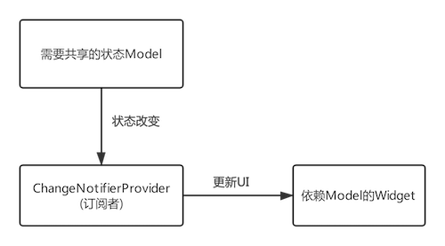

# 7.3 跨组件状态共享（Provider）

在Flutter开发中，状态管理是一个永恒的话题。一般的原则是：如果状态是组件私有的，则应该由组件自己管理；如果状态要跨组件共享，则该状态应该由各个组件共同的父元素来管理。对于组件私有的状态管理很好理解，但对于跨组件共享的状态，管理的方式就比较多了，如使用全局事件总线EventBus（将在下一章中介绍），它是一个观察者模式的实现，通过它就可以实现跨组件状态同步：状态持有方（发布者）负责更新、发布状态，状态使用方（观察者）监听状态改变事件来执行一些操作。下面我们看一个登陆状态同步的简单示例：

定义事件：

```dart
enum Event{
  login,
  ... //省略其它事件
}
```

登录页代码大致如下：

```dart
// 登录状态改变后发布状态改变事件
bus.emit(Event.login);
```

依赖登录状态的页面：

```dart
void onLoginChanged(e){
  //登录状态变化处理逻辑
}

@override
void initState() {
  //订阅登录状态改变事件
  bus.on(Event.login,onLogin);
  super.initState();
}

@override
void dispose() {
  //取消订阅
  bus.off(Event.login,onLogin);
  super.dispose();
}
```

我们可以发现，通过观察者模式来实现跨组件状态共享有一些明显的缺点：

1. 必须显式定义各种事件，不好管理
2. 订阅者必须需显式注册状态改变回调，也必须在组件销毁时手动去解绑回调以避免内存泄露。

在Flutter当中有没有更好的跨组件状态管理方式了呢？答案是肯定的，那怎么做的？我们想想前面介绍的`InheritedWidget`，它的天生特性就是能绑定`InheritedWidget`与依赖它的子孙组件的依赖关系，并且当`InheritedWidget`数据发生变化时，可以自动更新依赖的子孙组件！利用这个特性，我们可以将需要跨组件共享的状态保存在`InheritedWidget`中，然后在子组件中引用`InheritedWidget`即可，Flutter社区著名的Provider包正是基于这个思想实现的一套跨组件状态共享解决方案，接下来我们便详细介绍一下Provider的用法及原理。

## Provider

为了加强读者的理解，我们不直接去看Provider包的源代码，相反，我会带着你根据上面描述的通过`InheritedWidget`实现的思路来一步一步地实现一个最小功能的Provider。

首先，我们需要一个保存需要共享的数据`InheritedWidget`，由于具体业务数据类型不可预期，为了通用性，我们使用泛型，定义一个通用的`InheritedProvider`类，它继承自`InheritedWidget`：

```dart
// 一个通用的InheritedWidget，保存任需要跨组件共享的状态
class InheritedProvider<T> extends InheritedWidget {
  InheritedProvider({@required this.data, Widget child}) : super(child: child);
  
  //共享状态使用泛型
  final T data;
  
  @override
  bool updateShouldNotify(InheritedProvider<T> old) {
    //在此简单返回true，则每次更新都会调用依赖其的子孙节点的`didChangeDependencies`。
    return true;
  }
}
```

数据保存的地方有了，那么接下来我们需要做的就是在数据发生变化的时候来重新构建`InheritedProvider`，那么现在就面临两个问题：

1. 数据发生变化怎么通知？
2. 谁来重新构建`InheritedProvider`？

第一个问题其实很好解决，我们当然可以使用之前介绍的eventBus来进行事件通知，但是为了更贴近Flutter开发，我们使用Flutter中SDK中提供的`ChangeNotifier`类 ，它继承自`Listenable`，也实现了一个Flutter风格的发布者-订阅者模式，`ChangeNotifier`定义大致如下：

```dart
class ChangeNotifier implements Listenable {

  @override
  void addListener(VoidCallback listener) {
     //添加监听器
  }
  @override
  void removeListener(VoidCallback listener) {
    //移除监听器
  }
  
  void notifyListeners() {
    //通知所有监听器，触发监听器回调   
  }
   
  ... //省略无关代码
}

```

我们可以通过调用`addListener()`和`removeListener()`来添加、移除监听器（订阅者）；通过调用`notifyListeners()` 可以触发所有监听器回调。

现在，我们将要共享的状态放到一个Model类中，然后让它继承自`ChangeNotifier`，这样当共享的状态改变时，我们只需要调用`notifyListeners()` 来通知订阅者，然后由订阅者来重新构建`InheritedProvider`，这也是第二个问题的答案！接下来我们便实现这个订阅者类：

```dart
// 该方法用于在Dart中获取模板类型
Type _typeOf<T>() => T;

class ChangeNotifierProvider<T extends ChangeNotifier> extends StatefulWidget {
  ChangeNotifierProvider({
    Key key,
    this.data,
    this.child,
  });

  final Widget child;
  final T data;

  //定义一个便捷方法，方便子树中的widget获取共享数据
  static T of<T>(BuildContext context) {
    final type = _typeOf<InheritedProvider<T>>();
    final provider =  context.inheritFromWidgetOfExactType(type) as InheritedProvider<T>；
    return provider.data;
  }

  @override
  _ChangeNotifierProviderState<T> createState() => _ChangeNotifierProviderState<T>();
}
```

该类继承`StatefulWidget`，然后定义了一个`of()`静态方法供子类方便获取Widget树中的`InheritedProvider`中保存的共享状态(model)，下面我们实现该类对应的`_ChangeNotifierProviderState`类：

```dart
class _ChangeNotifierProviderState<T extends ChangeNotifier> extends State<ChangeNotifierProvider<T>> {
  void update() {
    //如果数据发生变化（model类调用了notifyListeners），重新构建InheritedProvider
    setState(() => {});
  }

  @override
  void didUpdateWidget(ChangeNotifierProvider<T> oldWidget) {
    //当Provider更新时，如果新旧数据不"=="，则解绑旧数据监听，同时添加新数据监听
    if (widget.data != oldWidget.data) {
      oldWidget.data.removeListener(update);
      widget.data.addListener(update);
    }
    super.didUpdateWidget(oldWidget);
  }

  @override
  void initState() {
    // 给model添加监听器
    widget.data.addListener(update);
    super.initState();
  }

  @override
  void dispose() {
    // 移除model的监听器
    widget.data.removeListener(update);
    super.dispose();
  }

  @override
  Widget build(BuildContext context) {
    return InheritedProvider<T>(
      data: widget.data,
      child: widget.child,
    );
  }
}
```

可以看到`_ChangeNotifierProviderState`类的主要作用就是监听到共享状态（model）改变时重新构建Widget树。注意，在`_ChangeNotifierProviderState`类中调用`setState()`方法，`widget.child`始终是同一个，所以执行build时，`InheritedProvider`的child引用的始终是同一个子widget，所以`widget.child`并不会重新`build`，这也就相当于对`child`进行了缓存！当然如果`ChangeNotifierProvider`父级Widget重新build时，则其传入的`child`便有可能会发生变化。

现在我们所需要的各个工具类都已完成，下面我们通过一个购物车的例子来看看怎么使用上面的这些类。

### 购物车示例

我们需要实现一个显示购物车中所有商品总价的功能：

1. 向购物车中添加新商品时总价更新

定义一个`Item`类，用于表示商品信息：

```dart
class Item {
  Item(this.price, this.count);
  double price; //商品单价
  int count; // 商品份数
  //... 省略其它属性
}
```

定义一个保存购物车内商品数据的`CartModel`类:

```dart
class CartModel extends ChangeNotifier {
  // 用于保存购物车中商品列表
  final List<Item> _items = [];

  // 禁止改变购物车里的商品信息
  UnmodifiableListView<Item> get items => UnmodifiableListView(_items);

  // 购物车中商品的总价
  double get totalPrice =>
      _items.fold(0, (value, item) => value + item.count * item.price);

  // 将 [item] 添加到购物车。这是唯一一种能从外部改变购物车的方法。
  void add(Item item) {
    _items.add(item);
    // 通知监听器（订阅者），重新构建InheritedProvider， 更新状态。
    notifyListeners();
  }
}
```

 `CartModel `即要跨组件共享的model类。最后我们构建示例页面：

```dart
class ProviderRoute extends StatefulWidget {
  @override
  _ProviderRouteState createState() => _ProviderRouteState();
}

class _ProviderRouteState extends State<ProviderRoute> {
  @override
  Widget build(BuildContext context) {
    return Center(
      child: ChangeNotifierProvider<CartModel>(
        data: CartModel(),
        child: Builder(builder: (context) {
          return Column(
            children: <Widget>[
              Builder(builder: (context){
                var cart=ChangeNotifierProvider.of<CartModel>(context);
                return Text("总价: ${cart.totalPrice}");
              }),
              Builder(builder: (context){
                print("RaisedButton build"); //在后面优化部分会用到
                return RaisedButton(
                  child: Text("添加商品"),
                  onPressed: () {
                    //给购物车中添加商品，添加后总价会更新
                    ChangeNotifierProvider.of<CartModel>(context).add(Item(20.0, 1));
                  },
                );
              }),
            ],
          );
        }),
      ),
    );
  }
}
```

运行示例后效果如图7-2所示：


每次点击”添加商品“按钮，总价就会增加20，我们期望的功能实现了！可能有些读者会疑惑，我们饶了一大圈实现这么简单的功能有意义么？其实，就这个例子来看，只是更新同一个路由页中的一个状态，我们使用`ChangeNotifierProvider`的优势并不明显，但是如果我们是做一个购物APP呢？由于购物车数据是通常回事整个APP共享的数据，会跨路由共享，如果我们将`ChangeNotifierProvider`放在整个应用的Widget树的根上，那么整个APP就可以共享购物车的数据了，这时`ChangeNotifierProvider`的优势将会非常明显。

虽然上面的例子比较简单，但它却将Provider的原理和流程体现的很清楚，图7-3是Provider的原理图：



Model变化后会自动通知`ChangeNotifierProvider`（订阅者），`ChangeNotifierProvider`内部会重新构建`InheritedWidget`，而依赖该`InheritedWidget`的子孙Widget就会更新。

我们可以发现使用Provider，将会带来如下收益：

1. 我们的业务代码更关注数据了，只要更新Model，则UI会自动更新，而不用在状态改变后再去手动调用`setState()`来显式更新页面。
2. 数据改变的消息传递被屏蔽了，我们无需手动去处理状态改变事件的发布和订阅了，这一切都被封装在Provider中了。这真的很棒，帮我们省掉了大量的工作！
3. 在大型复杂应用中，尤其是需要全局共享的状态非常多时，使用Provider将会大大简化我们的代码逻辑，降低出错的概率，提高开发效率。 

### 优化

我们上面实现的`ChangeNotifierProvider`是有两个明显缺点：代码组织为题和性能问题，下面我们一一讨论。

#### 代码组织问题

我们先看一下构建显示总价Text的代码：

```dart
Builder(builder: (context){
  var cart=ChangeNotifierProvider.of<CartModel>(context);
  return Text("总价: ${cart.totalPrice}");
})
```

这段代码有两点可以优化：

1. 需要显式调用`ChangeNotifierProvider.of`，当APP内部依赖`CartModel`很多时，这样的代码将很冗余。
2. 语义化不明确；由于`ChangeNotifierProvider`是订阅者，那么依赖`CartModel`的Widget自然就是订阅者，其实也就是状态的消费者，如果我们用`Builder` Widget来构建，语义话就不是很明确；如果我们能使用一个具有明确语义的Widget，比如就叫`Consumer`，这样最终的代码语义将会很明确，只要看到`Consumer`，我们就知道它是依赖某个跨组件或全局的状态。

为了优化这两个问题，我们可以封装一个`Consumer` Widget，实现如下：

```dart
// 这是一个便捷类，会获得当前context和指定数据类型的Provider
class Consumer<T> extends StatelessWidget {
  Consumer({
    Key key,
    @required this.builder,
    this.child,
  })  : assert(builder != null),
        super(key: key);

  final Widget child;

  final Widget Function(BuildContext context, T value) builder;

  @override
  Widget build(BuildContext context) {
    return builder(
      context,
      ChangeNotifierProvider.of<T>(context), //自动获取Model
    );
  }
}
```

`Consumer`实现非常简单，它通过指定模板参数，然后再内部自动调用`ChangeNotifierProvider.of`获取相应的Model，并且`Consumer`这个名字本身也是具有确切语义（消费者）。现在上面的代码块可以优化为如下这样：

```dart
Consumer<CartModel>(
  builder: (context, cart)=> Text("总价: ${cart.totalPrice}");
)
```

是不是很优雅！

#### 性能问题

上面的代码还有一个性能问题，就在构建”添加按钮“的代码处：

```dart
Builder(builder: (context) {
  print("RaisedButton build"); // 构建时输出日志
  return RaisedButton(
    child: Text("添加商品"),
    onPressed: () {
      ChangeNotifierProvider.of<CartModel>(context).add(Item(20.0, 1));
    },
  );
}
```

我们点击”添加商品“按钮后，由于购物车商品总价会变化，所以显示总价的Text更新是符合预期的，但是”添加商品“按钮本身没有变化，是不应该被重新build的。但是我们运行示例，每次点击”添加商品“按钮，控制台都会输出"RaisedButton build"日志，也就是说”添加商品“按钮在每次点击时其自身都会重新build！这是为什么呢？如果你已经理解了`InheritedWidget`的更新机制，那么答案一眼就能看出：这是因为构建`RaisedButton`的`Builder`中调用了`ChangeNotifierProvider.of`，也就是说依赖了Widget树上面的`InheritedWidget`（即`InheritedProvider` ）Widget，所以当添加完商品后，`CartModel`发生变化，会通知`ChangeNotifierProvider`, 而`ChangeNotifierProvider`则会重新构建子树，所以`InheritedProvider`将会更新，此时依赖它的子孙Widget就会被重新构建。

问题的原因搞清楚了，那么我们如何避免这不必要重构呢？既然按钮重新被build是因为按钮和`InheritedWidget`建立了依赖关系，那么我们只要打破或解除这种依赖关系就可以了。那么如何解除按钮和`InheritedWidget`的依赖关系呢？我们上一节介绍`InheritedWidget`时已经讲过了：调用`inheritFromWidgetOfExactType()` 和 `ancestorInheritedElementForWidgetOfExactType()`的却别就是前者会注册依赖关系，而后者不会。所以我们只需要将`ChangeNotifierProvider.of`的实现改为下面这样既可：

```dart
 //添加一个listen参数，表示是否建立依赖关系
  static T of<T>(BuildContext context, {bool listen = true}) {
    final type = _typeOf<InheritedProvider<T>>();
    final provider = listen
        ? context.inheritFromWidgetOfExactType(type) as InheritedProvider<T>
        : context.ancestorInheritedElementForWidgetOfExactType(type)?.widget
            as InheritedProvider<T>;
    return provider.data;
  }
```

然后我们将调用部分代码改为：

```dart
Column(
    children: <Widget>[
      Consumer<CartModel>(
        builder: (BuildContext context, cart) =>Text("总价: ${cart.totalPrice}"),
      ),
      Builder(builder: (context) {
        print("RaisedButton build");
        return RaisedButton(
          child: Text("添加商品"),
          onPressed: () {
            // listen 设为false，不建立依赖关系
            ChangeNotifierProvider.of<CartModel>(context, listen: false)
                .add(Item(20.0, 1));
          },
        );
      })
    ],
  )
```

修改后在此运行上面的示例，我们会发现点击”添加商品“按钮后，控制台不会再输出"RaisedButton build"了，即按钮不会被重新构建了。而总价仍然会更新，这是因为`Consumer`中调用`ChangeNotifierProvider.of`时`listen`值为默认值true，所以还是会建立依赖关系。

至此我们便实现了一个迷你的Provider，它具备Pub上Provider Package中的核心功能；但是我们的迷你版功能并不全面，如只实现了一个可监听的ChangeNotifierProvider，并没有实现只用于数据共享的Provider；还有就是我们的实现还有些边界没有考虑的到，比如如何保证在Widget树重新build时Model始终是单例等。所以建议读者在实战中还是使用Provider Package，而本节实现这个迷你Provider的主要目的主要是为了帮助读者了解Provider Package底层的原理。

### 其它状态管理包

现在Flutter社区已经有很多专门用于状态管理的包了，在此我们列出几个相对评分比较高的：

| 包名                                                         | 介绍                                          |
| ------------------------------------------------------------ | --------------------------------------------- |
| [Provider](https://pub.flutter-io.cn/packages/provider) & [Scoped Model](https://pub.flutter-io.cn/packages/scoped_model) | 这两个包都是基于`InheritedWidget`的，原理相似 |
| [Redux](https://pub.flutter-io.cn/packages/flutter_redux)    | 是Web开发中React生态链中Redux包的Flutter实现  |
| [MobX](https://pub.dev/packages/flutter_mobx)                | 是Web开发中React生态链中MobX包的Flutter实现   |
| [BLoC](https://pub.dev/packages/flutter_bloc)                | 是BLoC模式的Flutter实现                       |

在此笔者不对这些包做推荐，读者有兴趣都可以研究一下，了解它们各自的思想。

### 总结

本节通过介绍事件总线在跨组件共享中的一些缺点引出了通过`InheritedWidget`来实现状态的共享的思想，然后基于该思想实现了一个简单的Provider，在实现的过程中也更深入的探索了`InheritedWidget`与其依赖项的注册机制和更新机制。通过本节的学习，读者应该达到两个目标，首先是对`InheritedWidget`彻底吃透，其次是Provider的设计思想。

`InheritedWidget`是Flutter中非常重要的一个Widget，像国际化、主题等都是通过它来实现，所以我们也不惜篇幅，通过好几节来介绍它的，在下一节中，我们将介绍另一个基于`InheritedWidget`的组件Theme(主题)。


