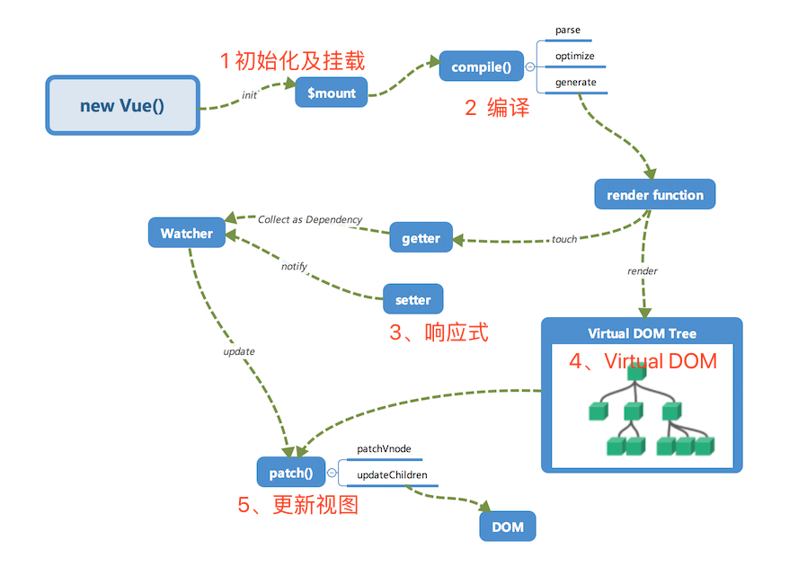

## 移动端基于vw和rem的根字号大小设置
跟字号大小和设备宽度实时关联。 百分比字号和像素字号同时存在是为了兼容所有浏览器，貌似Safari对像素字号支持有些小问题，而IE对百分比字号支持有些问题。

简单来说其方法为：
* 按照设计稿与设备宽度的比例，动态计算并设置 html 根标签的 font-size 大小；
* css 中，设计稿元素的宽、高、相对位置等取值，按照同等比例换算为 rem 为单位的值；
* 设计稿中的字体使用 px 为单位，通过媒体查询稍作调整。文本字号不建议使用rem
> 我们在iPhone3G和iPhone4的Retina屏下面，希望看到的文本字号是相同的。也就是说，我们不希望文本在Retina屏幕下变小，另外，我们希望在大屏手机上看到更多文本，以及，现在绝大多数的字体文件都自带一些点阵尺寸，通常是16px和24px，所以我们不希望出现13px和15px这样的奇葩尺寸。

头部设置
```javascript
<meta name="viewport" content="initial-scale=1,maximum-scale=1, minimum-scale=1">
```
view-port list:

```javascript
/**
320x480
320x568
320x569
360x640
360x740
375x667
375x812
384x640
411x731
411x823
414x736
412x732
480x853
540x960
600x960
600x1024
640x360
720x1280
768x1024
800x600 ?
800x1280
960x600
1024x768
1024x1336
1080x1920
1280x800
1280x950
1440x900
 */
```
### 具体实现：
#### 网易
  - 采用scale = 1.0写死viewport
  - 采用媒体查询来确定html根元素的font-size(rem)值，使用vw计算，px做向下降级兼容
  - 宽高字号等均使用rem
  - 百分比 + rem + flex布局
```javascript
//网易
@media screen and (max-width: 320px) {
  html {
    font-size: 42.667px;
    font-size: -webkit-calc(13.33333333vw);
    font-size: calc(13.33333333vw);
  }
}
@media screen and (min-width: 321px) and (max-width: 360px) {
  html {
    font-size: 48px;
    font-size: -webkit-calc(13.33333333vw);
    font-size: calc(13.33333333vw);
  }
}
@media screen and (min-width: 361px) and (max-width: 375px) {
  html {
    font-size: 50px;
    font-size: -webkit-calc(13.33333333vw);
    font-size: calc(13.33333333vw);
  }
}
@media screen and (min-width: 376px) and (max-width: 393px) {
  html {
    font-size: 52.4px;
    font-size: -webkit-calc(13.33333333vw);
    font-size: calc(13.33333333vw);
  }
}
@media screen and (min-width: 394px) and (max-width: 412px) {
  html {
    font-size: 54.93px;
    font-size: -webkit-calc(13.33333333vw);
    font-size: calc(13.33333333vw);
  }
}
@media screen and (min-width: 413px) and (max-width: 414px) {
  html {
    font-size: 55.2px;
    font-size: -webkit-calc(13.33333333vw);
    font-size: calc(13.33333333vw);
  }
}
@media screen and (min-width: 415px) and (max-width: 480px) {
  html {
    font-size: 64px;
    font-size: -webkit-calc(13.33333333vw);
    font-size: calc(13.33333333vw);
  }
}
@media screen and (min-width: 481px) and (max-width: 540px) {
  html {
    font-size: 72px;
    font-size: -webkit-calc(13.33333333vw);
    font-size: calc(13.33333333vw);
  }
}
@media screen and (min-width: 541px) and (max-width: 640px) {
  html {
    font-size: 85.33px;
    font-size: -webkit-calc(13.33333333vw);
    font-size: calc(13.33333333vw);
  }
}
@media screen and (min-width: 641px) and (max-width: 720px) {
  html {
    font-size: 96px;
    font-size: -webkit-calc(13.33333333vw);
    font-size: calc(13.33333333vw);
  }
}
@media screen and (min-width: 721px) and (max-width: 768px) {
  html {
    font-size: 102.4px;
    font-size: -webkit-calc(13.33333333vw);
    font-size: calc(13.33333333vw);
  }
}
@media screen and (min-width: 769px) {
  html {
    font-size: 102.4px;
    font-size: -webkit-calc(13.33333333vw);
    font-size: calc(13.33333333vw);
  }
}

```
#### 网易彩票
  - 采用scale = 1.0写死viewport
  - 采用媒体查询来确定html根元素的font-size值，即rem值
  - rem + 百分比布局
```javascript
@media screen and (min-width:240px) {
  html,body,button,input,select,textarea {
    font-size: 9px
  }
}

@media screen and (min-width:320px) {
  html,body,button,input,select,textarea {
    font-size: 12px
  }
}

@media screen and (min-width:374px) {
  html,body,button,input,select,textarea {
    font-size: 14px
  }
}

@media screen and (min-width:400px) {
  html,body,button,input,select,textarea {
    font-size: 15px
  }
}

@media screen and (min-width:413px) {
  html,body,button,input,select,textarea {
    font-size: 15.5px
  }
}

@media screen and (min-width:426px) {
  html,body,button,input,select,textarea {
    font-size: 16px
  }
}

@media screen and (min-width:450px) {
  html,body,button,input,select,textarea {
    font-size: 18px
  }
}

@media screen and (min-width:480px) {
  html,body,button,input,select,textarea {
    font-size: 18px
  }
}

@media screen and (min-width:540px) {
  html,body,button,input,select,textarea {
    font-size: 20.25px
  }
}

@media screen and (min-width:590px) {
  html,body,button,input,select,textarea {
    font-size: 22.13px
  }
}

@media screen and (min-width:600px) {
  html,body,button,input,select,textarea {
    font-size: 22.5px
  }
}

@media screen and (min-width:640px) {
  html,body,button,input,select,textarea {
    font-size: 24px
  }
}

@media screen and (min-width:720px) {
  html,body,button,input,select,textarea {
    font-size: 27px
  }
}

@media screen and (min-width:800px) {
  html,body,button,input,select,textarea {
    font-size: 30px
  }
}
```
适合使用VW的：
* 容器适配，可以使用vw
* 文本的适配，可以使用vw
* 大于1px的边框、圆角、阴影都可以使用vw
* 内距和外距，可以使用vw

#### 饿了么
- html根目录设置data-dpr="2" style="font-size: 75px;"
- 根据根html的dpr动态设置viewport
```javascript
<meta name="viewport" content="initial-scale=0.5, maximum-scale=0.5, minimum-scale=0.5, user-scalable=no, viewport-fit=cover">
```
- 宽高间距等使用vw,并配合rem向下兼容
```javascript
margin-top: .133333rem;
margin-top: 1.333333vw;
```
- 字号使用rem
- flex和百分比布局


#### 淘宝
 - 动态js设置根字体大小
 - 百分比+flex
 - 间距、图片宽高、容器宽高等均使用rem

#### 天猫设计方案
 - 采用scale = 1.0写死viewport
 - 不采用rem
 - px + flexbox布局
 - 字号 px

#### 京东
 - 采用scale = 1.0写死viewport
 - 媒体查询设置基准值
 - body固定最大宽度640px,可以看出来京东设计稿是以iphone4/5进行的
 - 百分比 + flex + rem布局
```javascript
html {
  font-size: 20px;
  font-size: 5.33333vw
}
@media screen and (max-width:320px) {
  html {
    font-size: 17.06667px
  }
}
@media screen and (min-width:540px) {
  html {
    font-size: 28.8px
  }
}
```

#### 今日头条
```javascript
//iphone6
<html style="font-size: 75px;" data-dpr="2">
根据[data-dpr="3"]和[data-dpr="2"]设置元素宽高、字体和坚决等
图片使用的是1x图
```

#### 张鑫旭
```javascript
//张鑫旭
@media screen and (min-width: 375px) {
    html {
        /* iPhone6的375px尺寸作为16px基准，414px正好18px大小, 600 20px */
        font-size: calc(100% + 2 * (100vw - 375px) / 39);
        font-size: calc(16px + 2 * (100vw - 375px) / 39);
    }
}
@media screen and (min-width: 414px) {
    html {
        /* 414px-1000px每100像素宽字体增加1px(18px-22px) */
        font-size: calc(112.5% + 4 * (100vw - 414px) / 586);
        font-size: calc(18px + 4 * (100vw - 414px) / 586);
    }
}
@media screen and (min-width: 600px) {
    html {
        /* 600px-1000px每100像素宽字体增加1px(20px-24px) */
        font-size: calc(125% + 4 * (100vw - 600px) / 400);
        font-size: calc(20px + 4 * (100vw - 600px) / 400);
    }
}
@media screen and (min-width: 1000px) {
    html {
        /* 1000px往后是每100像素0.5px增加 */
        font-size: calc(137.5% + 6 * (100vw - 1000px) / 1000);
        font-size: calc(22px + 6 * (100vw - 1000px) / 1000);
    }
}
```

> vm = 当前环境下元素尺寸（像素）/当前设备分辨率宽度（像素）*100，比如元素宽度是20px，设备宽是375px,那么: 20 / 375 * 100 = 5.3333vm，而vh就是相对于设备高度计算的啦

> 按需‘加载’css,@media还可以用在link标签上。
```javascript
<link rel="stylesheet" href="css/1.css" media='(max-width:500px)'>
```

> 注意使用autoprefixer自动补全css前缀

## 图片宽高
网易：（iphone6设计稿，基准50px）
* 小图
> 比如iphone6设计稿里是234*146，那么宽度= 234 / 2 / 50 = 1.46rem，高度类比

> 比如三个图铺满宽度，那么每个图片的宽度 = 375 / 50 /3 = 2.5，每个图片留点间距的话，宽度就小于2,5rem，假如设置宽度2.34rem，具体间距根据设计稿调整，算出宽度后，高度根据图片原始宽度比计算，比如原始图片（336 * 210），高/宽 = 0.625，那么高度=1.46rem

* 大图
> 比如单个图片铺满宽度，原图(1014*507)，图片距离左右各0.24rem和0.22rem，那么图片宽度=7.5 - 0.24 - 0.22 = 7.04rem，那么高度= 7.04 * 507 / 1014 = 3.52rem;如果没有间距的话，那么图片宽度就是
> 淘宝设置方法类似


# 图像处理方式
给你的用户提供最佳的图片资源其实是我们应该探讨和思考的问题。使用img元素的新属性srcset和sizes来，达到真正意义上给用户终端提供最正确的图片资源。

```javascript

```
> 在不支持 srcset 的浏览器上，浏览器只需使用 src 属性指定的默认图像文件。 正因如此，无论设备能力如何，一定要始终包含一个在任何设备上都能显示的 1x 图像。如果 srcset 受支持，则会在进行任何请求之前对逗号分隔的图像/条件列表进行解析，并且只会下载和显示最合适的图像。

> 另外，img的sizes属性也非常的强大。该属性可以使图片资源尺寸的值被用来指定图像的预期尺寸。当srcset使用vw描述符时，用户代理使用当前图像大小来选择srcset中合适的一个图像URL。被选中的尺寸影响图像的显示大小。如果没有设置srcset属性，或者没值，那么sizes属性也将不起作用。

```javascript

```
> 在上面的例子中，渲染了一张宽度为视窗宽度一半（sizes="50vw"）的图像，根据浏览器的宽度及其设备像素比，允许浏览器选择正确的图像，而不考虑浏览器窗口有多大。

在HTML5中新增了一个元素标签：<picture>。该元素可以通过若干个<source>，而且浏览器会自动匹配<source>的type、media、srcset等属性，来找到最适合当前布局、视窗宽度、设备像素密度的图像资源。其次在该元素里面还可以内嵌一个img标签，用来作为其降级处理，一旦浏览器不支持picture元素，会自动引入内嵌的img引入的图片。
```javascript
<picture> 
  <source media="(min-width: 800px)" srcset="head.jpg, head-2x.jpg 2x"> 
  <source media="(min-width: 450px)" srcset="head-small.jpg, head-small-2x.jpg 2x"> 
   
</picture>
```
在CSS中除background-image之外，CSS Images Module Level 4提供了一个image-set()函数，可以帮助我们根据不同的dpr显示不同的图像
```javascript
.logo {
  background-image: image-set(url(logo@1x.png); // 默认/降级处理
  background-image: image-set(url(logo@1x.png) 1x,url(logo@2x.png) 2x); 
}
```

借助媒体查询
```javascript
.logo { background-image: url(logo@1x.png); } // 默认/降级处理
@media (min-resolution: 2dppx),(-webkit-min-device-pixel-ratio: 2){ 
  .logo { background-image: url(logo@2x.png) } 
}

```


参考：
https://www.zhangxinxu.com/php/microCodeDetail?id=6
https://www.zhangxinxu.com/wordpress/2016/08/vw-viewport-responsive-layout-typography/
https://www.zhangxinxu.com/wordpress/2012/09/new-viewport-relative-units-vw-vh-vm-vmin/
